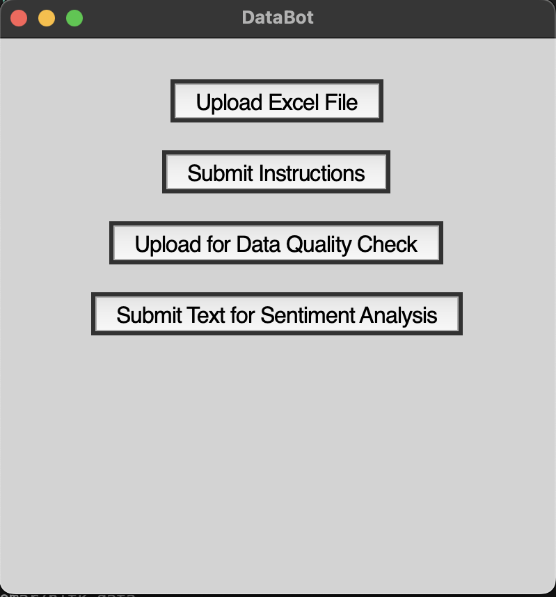
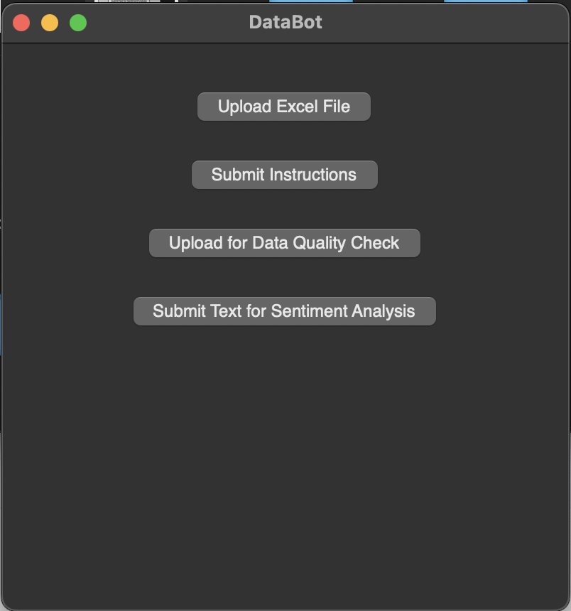
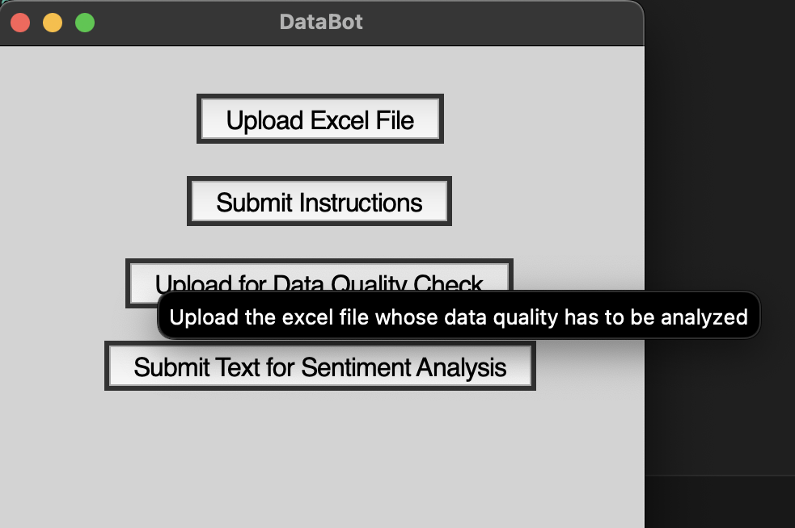
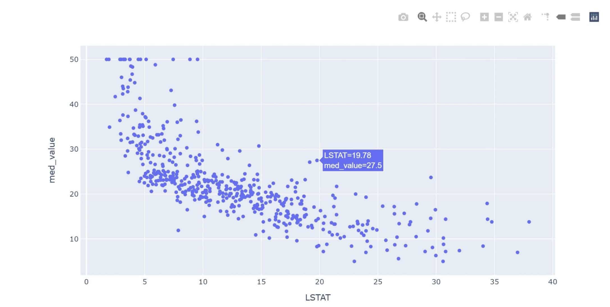
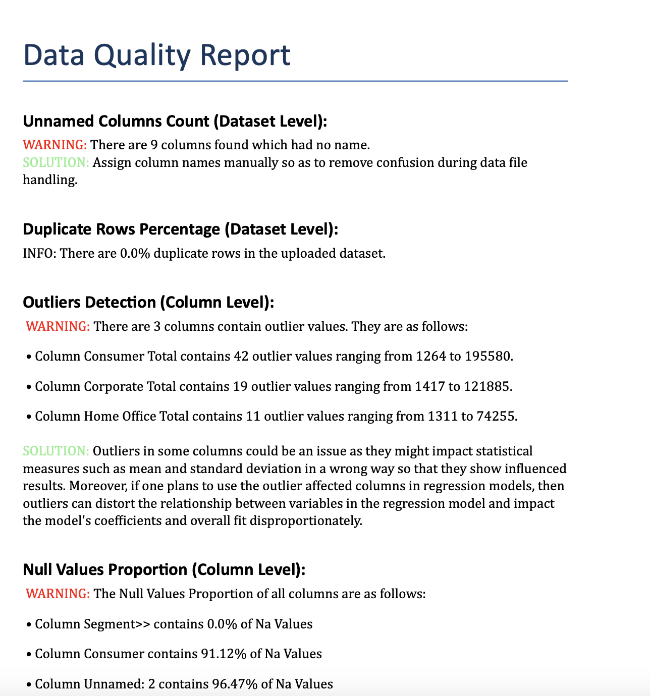
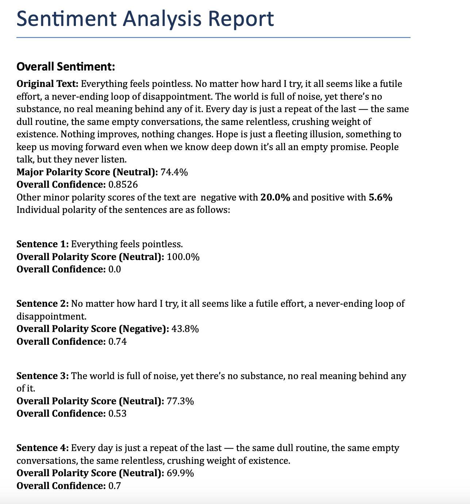

# Data Bot

This chatbot uses an NLP Model to create graphical plots based on user inputted data file and instructions. These instructions input the columns to be used for the creation of graphical plots. Additionally, this tool also does data quality check of uploaded data file along with sentiment analysis of user-inputted text.

## Description

The end-user will update a data file (xls or xlsx) based on which he/she provide an instruction which will consist of the columns to be used for creation of graphical plots. 
As a result, a downloadable graphical plot is returned back to the user. Including this main function, the following functions are available in this Data Bot:

1.) Creation of downloadable plots as required by the end-user. 
2.) Creation of a downloadable data quality check report.
3.) Creation of a sentiment analysis report of the textual input by end-user.

## Getting Started 

### Requirements to run and test the project:

To run this project, you will need Python3+, pip and Git installed on the system. 

The reference links are provided below.

> **Python:**
  https://www.python.org/downloads/
  
> **pip:**
  https://pypi.org/project/pip/

> **Git:**
  https://git-scm.com/downloads
	
The necessary libraries and packages are specified in the **requirements.txt** file and will be validated in the below steps

### Process for acquiring the results: 

  * **Step 1:**
  Create a local directory in your machine where you want to pull the git project and clone the project by running the below command from cmd 
  (Make sure that you are in the newly created directory first!):
  
  	```git clone https://github.com/AjayTomar3342/DataBot```

  * **Step 2:**
  From cmd, move into the main folder of the cloned project
  
 	 ```cd DataBot```

  * **Step 3:**
  Execute the below commands to meet the pre-requisites to execute the code
  
  ```  	
      Unix/macOS
      python -m pip install -r requirements.txt

      Windows
      py -m pip install -r requirements.txt
  ```

  
  * **Step 4:**
  Execute the below commands to run the code from cmd
  
  ``` 
      Unix/macOS
      python main.py

      Windows
      %run main.py
  ```


### Alternative Process for acquiring the results(Backup):

For quick running of program, PyCharm use is suggested as it has good controls for removing manual steps to pull a repository and get it running (Please only use this steps if your PyCharm IDE does not exhibit the issues mentioned below in Note).

Steps are:

  * **Step 1:**
  Make sure one is signed in on Github in Pycharm
  
  * **Step 2:**
  Open a new project
  
  * **Step 3:**
  Go to VCS Option on the Top Horizontal Options Bar
  
  * **Step 4:**
  Select Enable Version Control Integration Control inside VCS if not done already
  
  * **Step 5:**
  After checking the previous option on, select Checkout from Version Control and select Git
  
  * **Step 6:**
  In the new pop up window, include the link of the github repository you are trying to pull.
  Subsequently in the same pop up window, select an appropriate directory where the  project will be pulled.
  
  * **Step 7:**
  Select clone option to start the pulling process.
  
  * **Step 8:**
  Select option to start the pulled project in New Window or This window as per your personal preference.
  
  * **Step 9:**
  After this the project will be up and running and requirements.txt file will automatically install required libraries. Run the file main.py from Root Folder to get the results

This is a quick process to start the testing of GitHub project taken from the Official Jet Brains Website. We have tried this with several PC’s and are confident that this will not give any errors.

> **Link to Above Process Video:**
  https://www.youtube.com/watch?v=ukbvdF5wqPQ&feature=emb_title

  **NOTE:** 
* Since, the libraries used in the project are updated by the original developers regularly, some function/functions may not run as expected. This project will be regularly updated as per the updated libraries requirement, but if project does not run at any give time when you pull the project, it may be due to the library change, rather than a coding issue. This repository is last updated as per latest libraries on 31/12/2024.

* This program has been tested on both MacOS and Windows system. The IDE's used for testing on both these systems were PyCharm and Visual Code. The program worked satisfactorily for both IDE's in Windows OS but in MacOS, program faced some issues with PyCharm IDE. On development side, these issues were namely difficulty in changing background colour and sizing of Tkinter Window which would not be faced by end-users but would impact development of the program. On end-user side, the Tkinter window where user submit textual instructions does not make the text visible which might make it tough for the user to edit their instruction. Since these issues only show up in MacOS environment, PyCharm users operating on a Windows system will not face this issue. As per online research it looks like the issue with PyCharm on MacOS is due to a version issue which can only be solved from the JetBrains team. The alternative for MacBook users is to use VS Code for the operations of this program. 

## Procedure followed for various functions provided in the Project:

   * **Creation of Graphical Plots:**
   End-user opens the UI window and uploads an excel file which he/she wants to use for the creation of graphical plots (with button *Upload Excel File*). After uploading of this excel data file, user submits the instruction which consists of the columns to use for creation of the graphical plot (with button *Submit Instructions*). As default the following instruction is added in the dialog box **Please create a heatmap for Column Age, Column Id, Column Year and Column Gender**. Simply replace the plot type and column names so as to get desired results. As of now, the following graphical plots are supported for this program: Scatter Plot, Bar Plot, Line Plot, Pie Chart, Histogram, Box Plot, Area Plot, Bubble Plot, Dot Plot and Heatmap. 
   
   * **Creation of Data Quality Check Report:**
   After user clicks on the button Upload for *Data Quality Check*, he/she needs to upload the excel file for which data quality check report is desired. Soon after uploading, the processing inside the program will happen and a downloadable word document file will be provided as result to the user. Providing a word document instead of a pdf document is a deliberate decision as end-user might need to change a few things in the report (as per personal requirements) and doing that would require more effort with a pdf file. Regarding the data checks, the following aspects are checked for each column of the data file: Presence of unwanted columns, Presence of outliers, Null values proportion, Data Type Consistency, Summary statistics. Regarding the data checks for the overall excel file, Duplicate Rows percentage is analyzed and reported.  
   
   * **Creation of Sentiment Analysis Report:**
   End-User submits the text to be analyzed in the sentimental way using the button *Submit Text for Sentiment Analysis*. After some processing, user gets a detailed report which consists of polarity values for the overall text and each individual sentence in the text too.

  **NOTE:** 
* All result files are present in the *Result Files* folder.
* All user input files are stored in the *User Files* folder.

## UI & Results

### UI Screenshots

 
UI Screenshot obtained from MacOS with VSCode IDE.
  
UI Screenshot obtained from MacOS with PyCharm IDE.
  
<h1 align="center">UI Screenshot with descriptive hover-text obtained from MacOS with VSCode IDE.</h1>


### Results

 
Resulting Graphical Plot available for downloade by end-user. It might be beneficial for some users to use the graphical plot in the browser itself as engagement with the plot is interative in this format. 
  
Data Quality Check report screenshot from the resulting docx file. 

<p align="center">
  
**Sentiment Analysis report screenshot from the resulting docx file**
</p>


## Authors

Contributors names and contact info

1.) Ajay Tomar (https://www.linkedin.com/in/ajaytomar66/)
